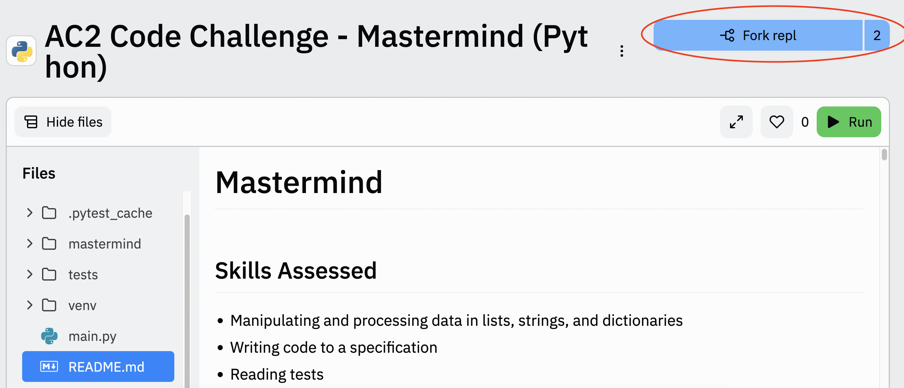

# Coding Challenge: Mastermind
Welcome to the Ada Developers Academy Accelerate Cohort 2 Coding Challenge.

# *** BUG WARNING 07/12/22 ***
We have become aware of a bug that will likely affect your ability to run unit tests once you begin implementing the game loop in Wave 5. Using modules such as `prompt-sync` or `readline-sync` to collect user input in Wave 5, implementing the game loop function `mastermind`, will prevent tests from running. 

If you encounter this bug, you will see a message 'Test suite failed to run' appear in the console when you attempt to run the unit tests.


Use of these modules and the presence of this bug will **not** negatively affect our evaluation of your submission. Further, the presence of this bug does not indicate that functions implemented in `game.js` for Waves 1-4 of the project are implemented incorrectly, or that you cannot call them in your game loop.

To run unit tests after you have begun implementing the game loop and have incorporated user input, comment out line 9 of `index.js`. 


Uncomment line 9 when you would like to play test your game loop.


While we cannot provide the exact error output you will see should you encounter this bug, we have provided some examples below.


## What we're looking for
- Ability to self-learn and apply material quickly because as a professional engineer you will continuously encounter new problems and technologies
- Fluency in the fundamentals of coding so that you are ready for Day 1 of Ada Accelerate.

In your technical interview you will review your completed solution to this problem with an Ada instructor. Be prepared to discuss the approach you took to solving this challenge and alternative routes you could have taken. The purpose is for the interviewer to understand your familiarity with CS fundamentals and evaluate your logical thinking and problem-solving skills.

## Skills Assessed
- Manipulating and processing data in arrays, strings, and objects
- Writing code to a specification
- Reading tests
  
## Assignment: Mastermind
Mastermind is a game in which one player, the codemaker, generates a code consisting of four colored pegs. Each peg can be one of six colors: red, yellow, green, blue, indigo, or violet. 

The second player, the codebreaker, attempts to guess the codemaker's code by submitting their own series of four colored pegs. After each guess, the codemaker provides the codebreaker with two numbers:
1. The number of pegs that are both the correct color and in the correct position
2. The number of pegs that are the correct color but in the wrong position

The codebreaker continues to submit guesses and receive feedback until they correctly guess the code. The aim of the game is to guess the codemaker's code in the least number of guesses. 

In this version of _Mastermind_, we will be using the letters `['R', 'Y', 'G', 'B', 'I', 'V']` to represent pegs colored red, yellow, green, blue, indigo, and violet respectively. 

We will also limit the maximum number of guesses to 8. If the codebreaker does not correctly guess the code within 8 guesses, they lose the game.

We will be creating a randomly generated code for the user to guess. 

You can play a GUI version of Mastermind [here](https://www.chiark.greenend.org.uk/~sgtatham/puzzles/js/guess.html).
## Project Write-Up: How to Complete and Submit

The goal of this project is to write code in `game.js` and `mastermind.js` so each of the functions and files meet the requirements outlined in the Project Directions below. 

When you are ready to submit your project, copy the url in your browser, and paste it into this [submission form](https://forms.gle/N5s7XkMxCiEYU5GK9). 

You can also find the submission form in the email you received inviting you to complete this coding challenge.

### One Time Project Set Up
If you do not yet have a replit account, create one by clicking the blue 'Sign up' button in the upper righthand corner of the screen. Follow the directions to create a free account, then navigate back to this page.


Once you've created an account, click the blue 'Fork repl' button in the upper righthand corner of the screen. 



Forking the project should take you to a new page with a complete copy of the project, now owned by your own account. 

Click the title of the project in the upper lefthand corner of the screen to rename it. Rename it to AC2 Code Challenge - [Your Name].

For example, AC2 Code Challenge - Ada Lovelace.


## Project Development Workflow
Provided is a general outline of the project workflow. More details for each step are below.

1. When you want to begin work on this project, ensure that you are editing your own forked version of the project. If you are in your fork, your username should display in blue before the project name in the top left corner of the screen.


2. Run the game and the tests to make sure the tests are working as expected. 
   
4. Use unit tests to verify the correctness of your functions in Waves 1-4 after thoroughly play testing. See instructions for running the tests in the section below.
   
6. Use play testing to guide the game loop development in Wave 5. 

7. Move through the waves one by one. 

8. As you make edits to your project, replit should autosave all of your changes.

## Details on Testing
***WARNING: See beginning of README for details on bug affecting unit testing***

Throughout the development of our project, we will use a combination of play testing and unit testing to help verify the correctness of our program. Unit testing is where we test small modules of our code individually. Play testing is where we run our program and play versions of our game as we develop it in order to discover and fix any flaws or bugs. 

To play test, click the green run button at the top of the screen. Your main game loop, `mastermind` will run, and you can play the game as you have designed it.


To unit test, click the icon with the check mark along the left side bar. The left panel should be titled Unit tests and display a series of tests beneath.


Click the blue button to run the tests.


To see the results of the unit tests, navigate to the Console.


Before beginning your project, run the unit tests. At this point, all unit tests should fail.

## Project Directions

### Get Familiar

Take time to read through the Wave 1 implementation requirements and the tests for Wave 1. Write down your questions, and spend some time going through your understanding of the requirements and tests. Make sure you can run the tests and see them fail.

### Wave 1: Game Setup
The first step in setting up a new game is to generate a code of 4 colors (represented as letters) for the user to guess. To do so, implement the function `generateCode` in `game.js`. This function should have the following properties:

- No parameters
- Returns an array of length 4
- Each element in the array should be any of the following letters: R, Y, G, B, I, V

### Wave 2: Validate Guesses and Game End Conditions
Next, we need a way to check if a user's guess is of the correct length and only uses valid letters.

To do so, implement the function called `validateGuess` in `game.js`. This function should have the following properties:

- Has one parameter
  - `guess` describes some input array
- Returns either `true` or `false`
- Returns `true` 
  - if every element in `guess` is one of the following letters: R, Y, G, B, I, V
  - the length of `guess` is 4 (the length of the generated code)
- Returns `false` if not; if there is a letter in `input` that is not R, Y, G, B, I, or V or the length of `input` is not 4
- `validateGuess` should be case insensitive
  - `input = ['R','Y','G','B']` should return `true`
  - `input = '['r','y','g','b']` should return `true`

#### Examples

|guess                 | output|
|:--------------------:|:-----:|
|['R','I','Y','G']     | true  |
|['R','M','Y','G']     | false |
|['R','i','Y','G']     | true  |
|['r','i','y','g']     | true  |
|['R','I','Y','G','B'] | false |

Once a user has entered their guess, we need a method to check whether or not the round has been won.

Implement a function called `checkWinOrLose` in `game.js`. This function should have the following properties:
- Has three parameters:
  - `guess`, which is a list of characters representing the user's guess
  - `code`, which is a list of characters representing the code the user is attempting to guess
  - `numGuesses`, which is an integer representing the total number of guesses the user has made in the round thus far
- Returns `true` if the user has won the game: `guess` and `code` are the same _and_ `numGuesses` is less than or equal to 8
- Returns `false` if the user has lost the game: if `guess` and `code` are not the same _and_ `numGuesses` is more than 8 
- Returns `null` otherwise - the game is still in progress

#### Examples

|guess                 | code              | numGuesses| output|
|:--------------------:|:-----------------:| :---------:|:-----:|
|['R','I','Y','G']     | ['R','I','Y','G'] |  3         | true  |
|['R','I','Y','G']     | ['R','I','Y','G'] |  8         | true  |
|['R','I','Y','G']     | ['R','I','Y','G'] |  9         | false |
|['R','I','Y','G']     | ['R','R','R','R'] |  9         | false |
|['R','I','Y','G']     | ['R','R','R','R'] |  3         | null  |

### Wave 3: Provide User Feedback
Now we need to provide feedback to the user about their guess as defined by the Mastermind game. The ultimate goal is to provide the user with two numbers:
1. The number of pegs that are both the correct color and in the correct position
2. The number of pegs that are the correct color but in the wrong position

To do this, we will write three functions: `colorCount`, `correctPosAndColor`, and `checkGuess`.

The first function to implement is `colorCount` in `game.js`. This function should have the following properties:
- Has two parameters:
  - `guess`, which is a string of characters representing the user's guess
  - `code`, which is a string of characters representing the code the user is attempting to guess
- Returns an integer representing the number of pegs that are the correct color (aka letter), **regardless of whether they are in the correct position or not**
- If no pegs are the correct color, `colorCount` returns `0`
- A letter that appears more times in `guess` than it appears in `code` is counted the number of times it appears in `code`
- A letter that appears fewer times in `guess` than it appears in `code` is counted the number of times it appears in `guess`


#### Examples

|guess              | code              | output|
|:-----------------:|:-----------------:|:-----:|
|['R','I','Y','G']  |['G','Y','I','R']  | 4     |
|['R','I','Y','G']  |['R','Y','I','G']  | 4     |
|['R','R','R','B']  |['B','I','R','R']  | 3     |
|['R','R','I','I']  |['B','R','R','R']  | 2     |
|['R','I','Y','G']  |['V','V','V','V']  | 0     |


The second function to implement is `correctPosAndColor` in `game.js`. This function should have the following properties:
- Has two parameters:
  - `guess`, which is an array of characters representing the user's guess
  - `code`, which is an array of characters representing the code the user is attempting to guess
  - Returns an integer representing the number of pegs in `guess` whose color (aka letter) is the same as the peg at the matching index in `code`
  - If no pegs in `guess` match both the color and index of those in `code`, `correctPosAndColor` returns `0`

#### Examples

|guess              | code              | output|
|:-----------------:|:-----------------:|:-----:|
|['R','I','Y','G']  |['R','I','Y','G']  | 4     |
|['R','I','Y','G']  |['G','Y','I','R']  | 0     |
|['R','R','R','B']  |['R','I','B','B']  | 2     |

The final function to implement is `checkGuess` in `game.js`. This function should have the following properties:
- Has two parameters:
  - `guess`, which is an array of characters representing the user's guess
  - `code`, which is an array of characters representing the code the user is attempting to guess
  - Returns an array of length 2 containing two integers
    - the first integer is the number of pegs in `guess` that have the same color and position as the corresponding pegs in `code`
    - The second integer is the number of pegs in `guess` that are the correct color but in a different position than the pegs in `code`

#### Examples

|guess              | code             | output|
|:-----------------:|:----------------:|:-----:|
|['R','I','Y','G']  |['G','Y','I','R'] | [0, 4]  |
|['R','I','Y','G']  |['R','Y','I','G'] | [2, 2]  |
|['R','R','R','B']  |['B','I','R','R'] | [1, 2]  |
|['R','R','I','I']  |['B','R','R','R'] | [1, 1]  |
|['R','I','Y','G']  |['V','V','V','V'] | [0, 0]  |


### Wave 4: Statistics
We also want to track statistics over multiple rounds and display those statistics at the end of each round. 

To aid us in this, implement `getWinPercentage` which has the following properties:
- Has two parameters
    - `wins`, which is an integer representing the number of games the user has won
    - `plays`, which is an integer representing the total number of rounds the user has played in the session
- Returns an integer representing the percentage of rounds won over the current session
    - the win percentage should round down

#### Examples

|wins  | plays | output|
|:----:|:-----:|:-----:|
|0     |0      | 0     |
|0     |4      | 0     |
|3     |4      | 75    |
|1     |15     | 6     |

Next, implement the `formatGuessStats` function which has the following properties:
- Has one parameter:
    - `guessStats`, an object where `key` `i` is the number of guesses and the paired `value` is the number of games won in that amount of guesses
- Returns an array of length 8
    - Element at index `i` of the array is a string of _n_ `X`s, where _n_ is the number of rounds won in `i+1` guesses
    - If _n_ is 0, the string should be empty

#### Examples

|guess_stats      | output                             |
|:---------------:|:----------------------------------:|
|{1: 1, 3:4, 5:1 }|['X', '', 'XXXX', '', 'X', '','','']| 
|{}               |['','','','','','','','']           |


### Wave 5: Game Loop
Using the functions built in previous waves, complete the `mastermind` function. Note that there are no tests to verify the correctness of your game loop. Instead use play testing and the example outputs provided below to guide your implementation.

The `mastermind` function should implement a game loop. The game loop is a loop that will keep the game running until the user wants to stop playing and defines the overall logic flow of the game. As part of our game loop, we will need to track the following data:
- `plays`, an integer representing the total number of rounds played
- `wins`, an integer representing the total number of rounds won
- `guessStats`, an object representing the number of rounds won in _n_ guesses 
    - Only rounds where the player won the game (total number of guesses was less than or equal to 8) are added to `guessStats`
- `guesses`, an integer representing the number of guesses the user has made in the current round

Your game loop does not need to match the example output we provide below word for word, however it should contain these basic components:
- Welcome message on program start
- Prompt for user input and give feedback on how that user input compares to the secret code continuously until the user either
    - correctly guesses the code
    - exceeds 8 guesses
- Winning message if the user correctly guesses the code in 8 guesses or under
- Losing message if the user fails to correctly guess the code in 8 guesses or under
- Print out of Session Statistics after a round finishes 
    - Number of rounds played
    - Win Percentage (what percentage of all rounds played were won)
    - Guess Distribution Graph:
        - How many of the rounds played were won with each possible number of guesses (1-8)
- Option to play another round


The game loop should begin the program with a welcome message.
#### Example Welcome Message
```
Welcome to Mastermind!
```

The game loop should then generate a new code to guess and give the user directions on how to play the game.

#### Example Instructions
```
Generating a new code...
New code generated: ****
Guess the code! Each character in the code is one of the following letters: R, Y, G, B, I, V
```

The game loop should then prompt the user to input a guess.
#### Example User Prompt
```
Guess the code:
```
The game loop should take the user's input and print it out.

#### Example Guess Print Out
```
Assume
    user_input = RRRB
----------
Game Loop Output
    You guessed: RRRB
```

If the user did not correctly guess the secret code, we should also print out feedback about how many of the letters in their guess were the correct color and in the correct position and how many were the correct color but in the wrong position.

#### Example Guess Feedback
```
Assume 
    code = BIRR
    user_input = RRRB
------
Game Loop Output
    (1,2)
```

The game loop should continue to prompt the user for new guesses and provide corresponding feedback until they have correctly guessed the code or surpassed 8 guesses.
#### Example Feedback Loop
```
Assume 
    code = BIRR
------
Game Loop Output
    You guessed: RRRB
    (1,2)
    Guess the code: 
    You guessed: BRRR
    (3,0)
    Guess the code:
    You guessed: BRGR
    (2,1)
    Guess the code:
    ...
```

If the user correctly guesses the code at any point during the game, they have won the game. The game loop should stop prompting them for additional guesses and display a message congratulating them for winning the game.

```
Assume 
    code = BIRR
------
Game Loop Output
    You guessed: BIRR
    Congratulations! You guessed the secret code!
```

If the user has made 8 guesses and still has not correctly guessed the secret code, they have lost the game. The game loop should stop prompting them for additional guesses and display a lose message.
```
Assume 
    code = BIRR
------
Game Loop Output
    Guess the code:
    You guessed: RRRB
    (1,2)
    Guess the code: 
    You guessed: RRRB
    (1, 2)
    Guess the code:
    You guessed: RRRB
    (1, 2)
    Guess the code:
    You guessed: RRRB
    (1,2)
    Guess the code: 
    You guessed: RRRB
    (1, 2)
    Guess the code:
    You guessed: RRRB
    (1,2)
    Guess the code: 
    You guessed: RRRB
    (1, 2)
    Guess the code:
    You guessed: RRRB
    (1,2)
    You lost 😥 Better luck next time!
```
Regardless of whether the player wins or loses, once the round has finished, the game loop should print out statistics about the session so far. Statistics should include:
- Number of rounds played
    - Win Percentage (what percentage of all rounds played were won)
    - Guess Distribution Graph:
        - How many of the rounds played were won with each possible number of guesses (1-8)
#### Example Session Statistics
```
STATISTICS
Games Played: 10
Win %: 80
Guess Distribution:
1| X
2| 
3| XXX
4| 
5| 
6| XX
7| X
8| X 
```
Finally, after printing out the session statistics, the game loop should ask the user whether they would like to play again. If the user responds yes, a new round of the game should begin. Otherwise, the program should end.
#### Example Play Again Prompt
```
Should we play another round?
Enter y to replay, any other character to exit:
```


#### Example of Full Game Loop
Note that lines marked #### denote user input and are not printed by the program as part of the game loop
```
Welcome to Mastermind!
Generating a new code...
New code generated: ****
Guess the code! Each character in the code is one of the following letters: R, Y, G, B, I, V
Guess the code: 
####user input: GRRY
You guessed: GRRY
Congratulations! You guessed the secret code!
STATISTICS
Games Played: 1
Win %: 100
Guess Distribution:
1| X
2| 
3| 
4| 
5| 
6| 
7| 
8| 
Should we play another round?
Enter y to replay, any other character to exit: 
####user input: y

Generating a new code...
New code generated: ****
Guess the code! Each character in the code is one of the following letters: R, Y, G, B, I, V
Guess the code: 
####user input: RRRB
You guessed: RRRB
(1,2)
Guess the code: 
####user input: BIRR
You guessed: BIRR
Congratulations! You guessed the secret code!
STATISTICS
Games Played: 2
Win %: 100
Guess Distribution:
1| X
2| X
3| 
4| 
5| 
6| 
7| 
8| 
Should we play another round?
Enter y to replay, any other character to exit: 
####user input: y

Generating a new code...
New code generated: ****
Guess the code! Each character in the code is one of the following letters: R, Y, G, B, I, V
Guess the code: 
####user input: RRRR
You guessed: RRRR
(1,2)
Guess the code: 
####user input: RRRR
You guessed: RRRR
(1,2)
Guess the code: 
####user input: RRRR
You guessed: RRRR
(1,2)
Guess the code: 
####user input: RRRR
You guessed: RRRR
(1,2)
Guess the code: 
####user input: RRRR
You guessed: RRRR
(1,2)
Guess the code: 
####user input: RRRR
You guessed: RRRR
(1,2)
Guess the code: 
####user input: RRRR
You guessed: RRRR
(1,2)
Guess the code: 
####user input: RRRR
You guessed: RRRR
(1,2)
You lost 😥 Better luck next time!
STATISTICS
Games Played: 3
Win %: 66
Guess Distribution:
1| X
2| X
3| 
4| 
5| 
6| 
7| 
8| 
Should we play another round?
Enter y to replay, any other character to exit: 
####user input: n
```